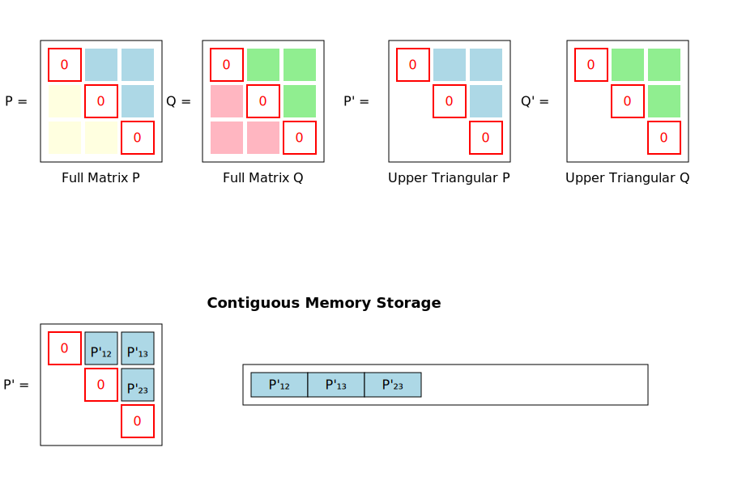
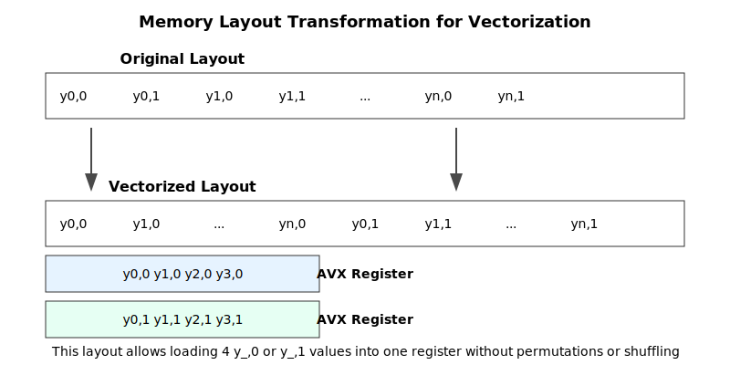

### Making t-SNE _fast_

The t-Distributed Stochastic Neighbor Embedding (t-SNE)
is the de facto standard for visualizing high dimensional
datasets but its original, still widely used variant is lacking
fast implementations. We were tasked to make this _fast_ in
an academic ([literally](https://acl.inf.ethz.ch/teaching/fastcode/2024/)) setting on a the
single-core x86 Skylake architecture. There are
lots of [smart ways](https://lvdmaaten.github.io/tsne/) to accelerate
and program this algorithm. The following will thus explore very
architecture- and compiler-specific performance of our optimizations. We do not introduce
any algorithmic innovations like numerical approximations or different data structures. We stay with the
**"exact thing"**.

| Instr. | DP Throughput [cycles/instr.] | SP Throughput [cycles/instr.] |
|:------:|:-----------------------------:|:-----------------------------:|
| ADD/SUB |             0.5              |              0.5              |
| MUL/FMA |             0.5              |              0.5              |
|  DIV   |              8               |               5               |

(from uops.info)

##### Algorithmic considerations
t-SNE is a non-linear dimensionality reduction algorithm that converts a high-dimensional data set
$X = \{ x_1, x_2, ..., x_n\} \subset \mathbb R^d$ of cardinality $n$ into a lower-dimensional
(commonly three- or two-dimensional for visualization) dataset $Y = \{y_1, y_2, ..., y_n\} \subset \mathbb R^{d'}$.
t-SNE aims to preserve as much of the local and global structure of the high
dimensional dataset in the low dimensional embedding as is possible. To this end, the pairwise similarities between the high dimensional data points,
$P_{ij}$, are captured in a joint probability distribution $P \in \mathbb R^{n\times n}$, where 

$$P_{ij} := \frac{p_{j \mid i} + p_{i \mid j}}{2n}$$

is expressed in terms of the conditional probabilities $p_{j\mid i}$ and $p_{i\mid j}$ defined as follows:

$$p_{j \mid i} := \frac{\exp\left(-\|x_i - x_j\|^2 / 2\sigma_i^2\right)}{\sum_{k \neq i} \exp\left(-\|x_i - x_k\|^2 / 2\sigma_i^2\right)}$$

The different $\sigma_i$ are determined using binary search such that
the conditional probability distribution $p_{\cdot|i}$ has a certain perplexity.
The similarities of the low dimensional embeddings on the other hand are captured in the
joint probability distribution $Q$ with entries:

$$Q_{ij} := \frac{\left(1 + \|y_i - y_j\|^2\right)^{-1}}{\sum_{k \neq l} \left(1 + \|y_k - y_l\|^2\right)^{-1}}$$

The algorithm then minimizes the dissimilarity between the two similarity distributions $P$ and $Q$ using the
Kullback-Leibler divergence as a measurement:

$$C := KL(P\mid\mid Q) = \sum_{i \neq j}P_{ij} \log \frac{P_{ij}}{Q_{ij}}$$

To minimize the cost function $C$ the algorithm iteratively updates the low-dimensional embeddings using gradient descent.
The gradient of $C$ in respect to a low-dimensional embedding vector $y_i$ can be expressed as follows:

$$\frac{\partial C}{\partial y_i} = 4 \sum_j \frac{\left(P_{i j}-Q_{i j}\right)\left(y_i-y_j\right)}{1+\left\|y_i-y_j\right\|^2}$$

The gradients are then used to update the current embedding $Y^{(t)}$ to obtain the next embedding $Y^{(t+1)}$, potentially with an added momentum
$\alpha(t) \geq 0$:

$$y_i^{(t+1)} = y_i^{(t)} + \eta \frac{\partial C}{\partial y_i} + \alpha(t) (y_i^{(t)} - y_i^{(t-1)})$$

###### Phases
The algorithm can be divided into two phases, an initialization phase and an iterative phase.
During the former the entries of the similarity matrix $P$ are calculated.
This needs only be done once as the entries only depend on the static input data $X$. 
This computation is dominated by the exponentiation for the $p_ij$'s
which on most modern processors is more expensive than a memory load.

It is thus computationally more efficient to compute $P$ only once and hold its data in memory.
Then $Q$ is computed for $T$ iterations as a function of the changing low-dimensional embeddings $Y$ of the previous iteration.
Subsequently, the gradients $\frac{\partial C}{\partial y_i}$ of the cost function are calculated.

In this phase the computation of the matrix $Q$ and the gradients dominate the procedure as both
are quadratic in time complexity. All other steps run in linear time and their weight in the computation
decreases with an increase in the size of the input dataset.
In summary, the algorithm runs in $\mathcal{O}(n^2)$ time,
while our implementation also has an $\mathcal O(n^2)$ space requirement.

#####  Baseline implementation and Roofline model

Our baseline implementation in C closely mirrors the original
[Python implementation by van der Maaten](https://lvdmaaten.github.io/tsne/).
During the initialization phase, the matrix $P$ is computed once and stored in memory to avoid repeated,
computationally expensive exponentiation. In the iterative phase, the baseline implementation first computes
the nominators of $Q$, defined as

$$Q_{ij} = (1+||y_i - y_j||^2)^{-1}$$

and stores them in memory.
Concurrently, it sums all values to facilitate the final computations in the subsequent step.
In the second step, each entry of $Q'$ is normalized by dividing by the sum of all entries, resulting in the final $Q$.
The gradient is then computed as the final part of the process and the embeddings are updated.
All other operations besides `compute_p`, `compute_q`, and `compute_gradient`
scale linearly in the number of input points $n$. Consequently, it makes sense to focus on optimizing these three functions.
Specifically, `compute_q` and `compute_gradient` of the second phase
are the most resource intensive and therefore need a detailed investigation for optimization.

##### Computing Q online
Note that both the computation of $Q$ as well as the gradient include the expensive
division operation $(1+||y_i - y_j||^2)^{-1}$. By the time this value is needed for the gradient 
it is no longer available in memory since the entries of $Q$ have already been divided by its sum.
This observation very naturally indicates the first optimization. Instead of dividing $Q$ by the sum
and storing the result back to memory only the $Q$ nominator values are kept in memory and
divided by the sum term "online" as they are needed. Note here that this multiplication with the
inverse sum has to be done just once for every iteration and only when needed.

The nominator
of $Q_{ij}$ also appears in the gradient computation, the value from memory can now be reused instead
of recomputing the expensive division. While dividing the $Q_{ij}$ elements on the go is clearly better
as it removes one full round of loading, dividing and storing the trade-off between loading the
saved $Q_{ij}$ nominator from memory in the gradient computation instead of recomputing it is not as obvious.
Using the AVX2 instruction set on Skylake a division costs 2 cycles per value or 8 cycles for the whole vector.
Based on our memory measurements using the [STREAM benchmark](https://github.com/jeffhammond/STREAM)
we can load around 1 double precision floating point value per cycle.
Thus the storing and loading division's result is better than recomputing it.

##### Compressing P and Q

Since $P$ and $Q$ are both symmetric and zero along their diagonals,
it is sufficient to compute and store only their upper triangular form.
Roughly $\frac{n^2}{2}$ loop iterations are performed in `compute_p`,
`compute_q` and `compute_gradient`. Furthermore around $8 n^2$ bytes of memory
are needed to store them both.

##### Manual vectorization

The interleaved format of the embedding $Y$ and its gradient $dY$ in memory are complex.
The values in the arrays $Y$ and $dY$ are stored in the following format:

$$\[y_{0, 0}, y_{0, 1}, y_{1, 0}, y_{1, 1}, ...,  y_{n,0}, y_{n,1}\]$$

To allow for better vectorization, we consider the sequence

$$\[y_{0, 0}, y_{1, 0}, ..., y_{n, 0}, y_{0, 1}, y_{1,1}, ..., y_{n,1}\]$$

##### Implementing cache blocking

Our implementation at this stage computes the nominators for $Q$ in the following iterative process:
For every $1 \leq i \leq n$, all $i < j \leq n$ are iterated to compute the corresponding
$Q_{ij}$ nominator. This process requires access to both $y_i$ and $y_j$.
Similar for the gradient: For each $i$, all $j$ are looped over to compute $\frac{\partial C}{ \partial y_i}$.
This approach results in a significant number of unnecessary L1 cache misses if the low-dimensional points
do not fit entirely there.

The computation can be blocked to optimize. By loading two blocks of low-dimensional data points into L1
all $Q_ij$ values associated with these blocks can then be computed.

The block size should be chosen in a way that two blocks of low dimensional embeddings fit into fast cache.
This way the number L1 misses roughly decreases by a factor of $B$ for large $n$.
Memory layout has to be changed accordingly.

TODO: graphical explainer

##### Register blocking

Computation of $\frac{\partial C}{\partial y_i}$ requires
loading all $y_j$ for $j > i$.
It is thus efficient to compute this gradient for multiple $i$ values at once, decreasing the number of $y_j$ loads.

This optimization is limited by the number of available registers, we propose to saturate the registers more efficiently.
Some registers are needed to hold intermediate results, such as the current sum.
Computing the gradients for two consecutive $i$ values at once provides the highest performance increase on Skylake processors.

TODO: graphical explainer

##### Prefetching

$P$ and $Q$ are often loaded as we have learned.
An idea is to inverne into the prefetching paradigm the scheduler comes up with.
We found an ideal value for the Skylake architecture here.

Choosing too large values will overflow L1, while choosing too small values will not help due to the high memory latency.

TODO: graphical explainer

##### Final analysis

[ ] Roofline plot

[ ] Performance multiple compared to sklearn

[ ] Autotuner option

[ ] Compiler differences

#### Parting thoughts

